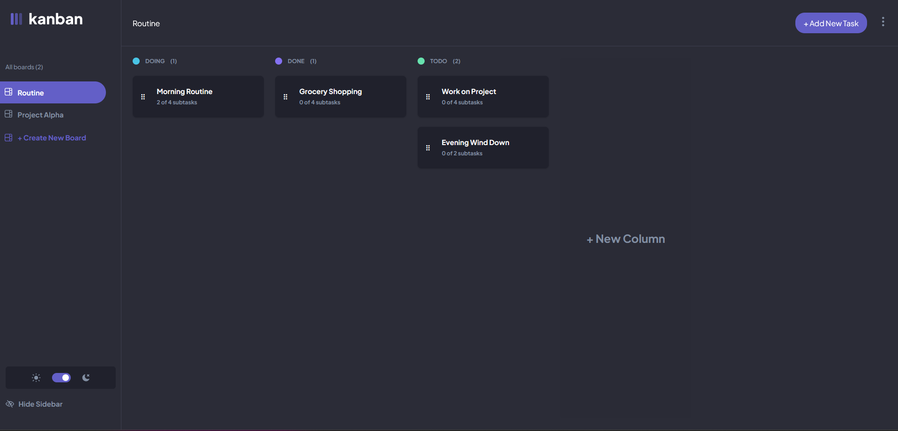
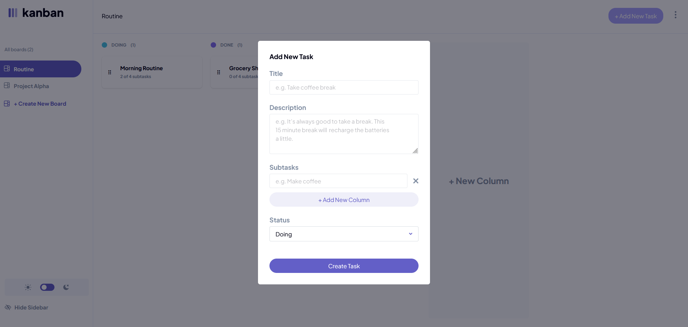
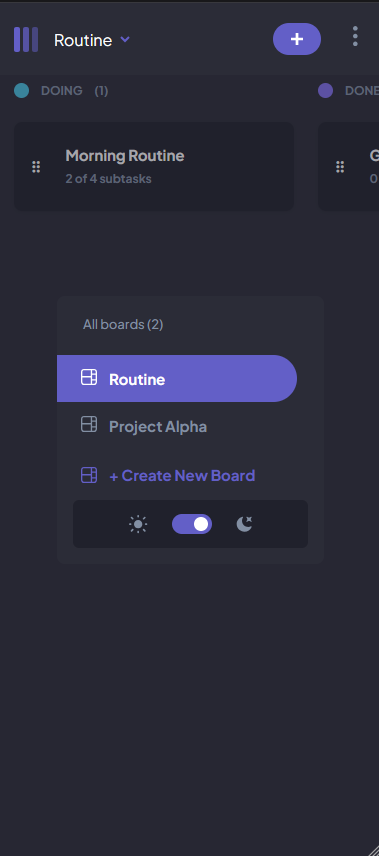
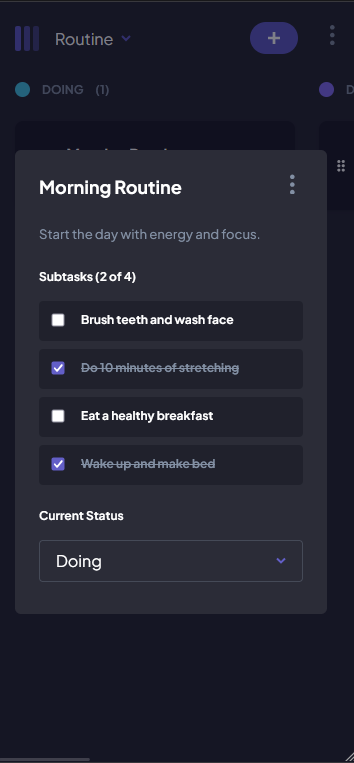

# About project

A full-featured Kanban-style task management application where users can organize projects into boards and columns, manage tasks, and track progress visually.

## Key Features:

- Boards & Columns: Create multiple boards, each with customizable columns representing task stages (e.g., To Do, In Progress, Done).

- Tasks & Subtasks: Add tasks with detailed descriptions and nested subtasks; track completion progress.

- Drag & Drop: Rearrange tasks between columns using smooth drag-and-drop interactions powered by @dnd-kit.

- Task Modals: View and edit task details in modals; update title, description, subtasks, and column assignment.

- Responsive Design: Built with Tailwind CSS for mobile-friendly, modern styling.

- Backend API: NestJS provides REST endpoints for boards, columns, tasks, and subtasks with proper relations and validation.

- State Management: Redux manages the client-side state for boards, columns, and tasks.

- Realistic Interactions: Subtasks can be toggled, tasks can move between columns, and updates persist via API calls.

## Tech Highlights:

- React Router handles SPA routing with multiple boards and task views.

- Tailwind CSS ensures clean, maintainable, and responsive UI.

- NestJS manages relational data and enforces type-safe, validated DTOs.

- Supports optimistic UI updates for subtasks and task edits.

# Screenshots

